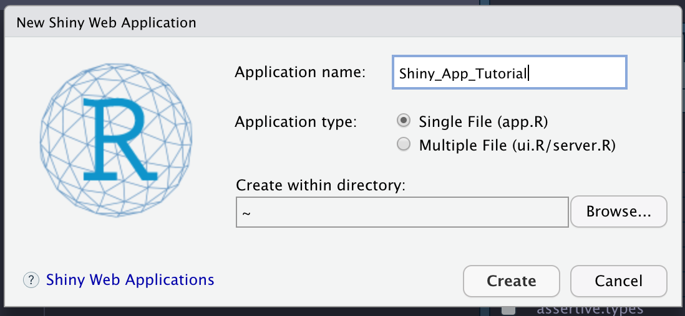
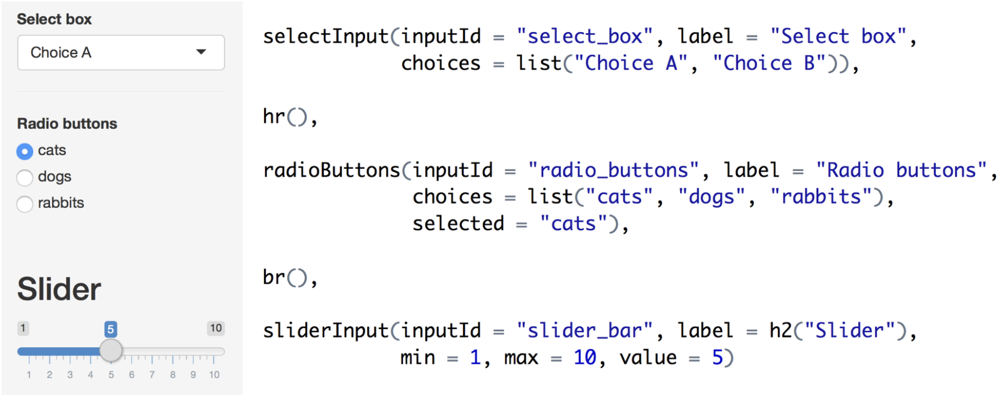

# Craft Breweries and Beers Shiny App Tutorial

This is a Shiny App Tutorial put together for the Department of Biostatistics at CU Anschutz Seminar on 11/9/22. This app uses the Craft Breweries and Beers dataset from https://www.kaggle.com/datasets/nickhould/craft-cans.

## Creating Your Shiny App

To begin, create a folder that will house your app code and data file. You can either use the skeleton code, provided in the `Shiny_Skeleton` folder, and build the app manually or refer to my completed app in the `Shiny_Complete` folder. Once you download the folder, you'll want to change the folder's name as it will be the domain name for the app. 

You can also start your Shiny App from scratch within R. Select 'File > New File > Shiny Web App...'. We are going to use a single 'app.R' file for this tutorial. For more complicated apps, it's recommended to use a separate 'server.R' and 'ui.R' file. 

<p align="center">
  
</p>

Each Shiny App is comprised of a `ui` and a `server` component. 

* `ui` : The user interface defines how the app will look, including color theme, sidebar panel options, tab layouts, and figure/text layouts. 
* `server` : The server contains the instructions to create the app. This is where you can build plots for the app.


## Setting Up the App Workspace

The following are the packages we will use within the app. 

``` r
## Libraries 
library(shinythemes)
library(plotly)
library(tidyverse)
library(usmap)
library(viridis)
library(ggplot2)
library(ggrepel)
```

To read in the data, don't include a path to a directory. The dataset just needs to be within the folder. 

``` r 
## Data
df <- readRDS("beers_clean.rds")
```

## Designing the UI

### Theme and Title 

One fun customization you can make within your Shiny App is the theme. I have a preference for the `flatly` theme. You can explore more theme options at https://rstudio.github.io/shinythemes/.

Each application needs a title, which you can specify with the `titlePanel` function. 

``` r
# Set theme
theme = shinytheme("flatly"),

# Application title
titlePanel("US Beers and Breweries"),
    
```

### Sidebar Design

The Sidebar panel can be customized in a number of ways. 

<p align="center">
  
</p>

*http://juliawrobel.com/tutorials/shiny_tutorial_nba.html*

### Plot Design

## Designing the Server

Before setting code up in the server, I usually run it within an R script to make sure everything works well. It's easier to modify your code outside of the app then when you're working within the server code. 

## Connecting the App a
Create an account at https://www.shinyapps.io/


