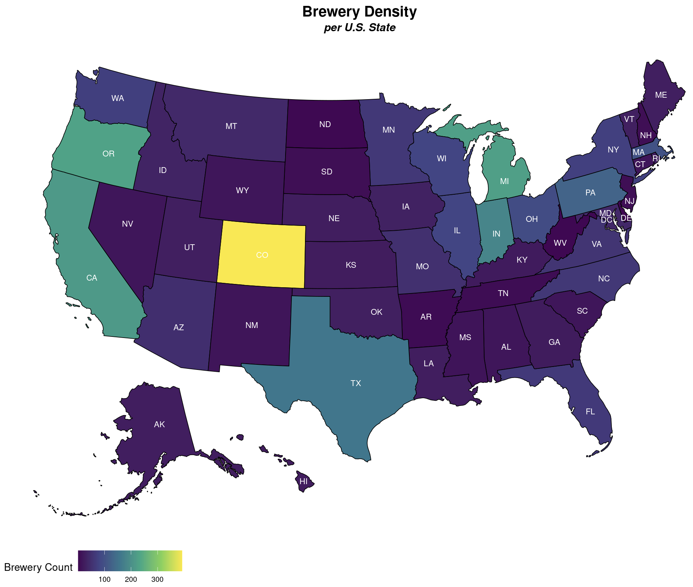

# Craft Breweries and Beers Shiny App Tutorial

This is a Shiny App Tutorial put together for the Department of Biostatistics at CU Anschutz Seminar on 11/9/22. This app uses the Craft Breweries and Beers dataset from https://www.kaggle.com/datasets/nickhould/craft-cans.

## Data Summary

The beers dataset contains 12 variables, cleaned from the datasets provided on kaggle. Code used to clean the data is provided in the `sa_tutorial_datacleaning.R` file. The variables represent 

* `state` : The two character state initial
* county : County of the brewery location
* city : City of the brewery location 
* abv : The alcohol percentage of the beer
* ibu : The international bitterness unit of the beer 
* id : ID given to each unique beer
* name : Name of the beer 
* style : Style of the beer 
* brewery_id : ID given to each unique brewery 
* ounces : The fluid ounces the beer is served as
* brewery : The brewery name the beer comes from 
* fips : An county and state identifier. The first two digits correspond to state and the final 3 correspond to county. 

<p align="center">
  
</p>

## Creating Your Shiny App

To begin, create a folder that will house your app code and data file. You can either use the skeleton code, provided in the `Shiny_Skeleton` folder, and build the app manually or refer to my completed app in the `Shiny_Complete` folder. Once you download the folder, you'll want to change the folder's name as it will be the domain name for the app. 

You can also start your Shiny App from scratch within R. Select 'File > New File > Shiny Web App...'. We are going to use a single 'app.R' file for this tutorial. For more complicated apps, it's recommended to use a separate 'server.R' and 'ui.R' file. 

<p align="center">
  
</p>

Each Shiny App is comprised of a `ui` and a `server` component. 

* `ui` : The user interface defines how the app will look, including color theme, sidebar panel options, tab layouts, and figure/text layouts. 
* `server` : The server contains the instructions to create the app. This is where you can build plots for the app.


## Setting Up the App Workspace

The following are the packages we will use within the app. 

``` r
## Libraries 
library(shiny)
library(shinythemes)
library(plotly)
library(tidyverse)
library(usmap)
library(viridis)
library(ggplot2)
library(ggrepel)
```

To read in the data, don't include a path to a directory. The dataset just needs to be within the folder. 

``` r 
## Data
df <- readRDS("beers_clean.rds")
```

The basic skeleton of any Shiny App will be 

``` r 
library(shiny) 

# Define UI ----
ui <- fluidPage(
  
)

# Define server logic ----
server <- function(input, output) {
  
}

# Run the app ----
shinyApp(ui = ui, server = server)
```

When you're ready, you can run even an empty ShinyApp either by running 

``` r 
runApp("App Name")
```

or by clicking the `Run App` button at the top of your R window

<p align="center">
  
</p>

*https://shiny.rstudio.com/tutorial/written-tutorial/lesson1/*

## Designing the UI

### Theme and Title 

One fun customization you can make within your Shiny App is the theme. I have a preference for the `flatly` theme. You can explore more theme options at https://rstudio.github.io/shinythemes/.

Each application needs a title, which you can specify with the `titlePanel` function. 

``` r
# Set theme
theme = shinytheme("flatly"),

# Application title
titlePanel("US Beers and Breweries"),
    
```

### Sidebar Design

The Sidebar panel can be customized in a number of ways, referred to as [widgets](https://shiny.rstudio.com/tutorial/written-tutorial/lesson3/). 

<p align="center">
  
</p>

*http://juliawrobel.com/tutorials/shiny_tutorial_nba.html*

In our app, we are going to have two types of selections; a drop down list for the state and a multiple selection radio button for beer type. We will specify this in our `ui` code with the following 

``` r 
sidebarLayout(
        sidebarPanel(
            # Drop down selection for State
            selectInput("state_choice", label = "Select State",
                choices = c("All States", unique(df$state)), 
                selected = character(0)),
            
            # Drop down selection for Beer Type
            checkboxGroupInput("beer_choice", label = "Select Beer Type",
                 choices = c(unique(df$style)), 
                 selected = c(unique(df$style)))
        ),
```

This code produces the following sidebar, which has an option for "All States" and lists each individual state and has all beer types selected. 

<p align="center">
  
</p>

In the `sidebarLayout` function, we can also specify the Tabs and which plots will belong to each Tab. For our app, we'll have 3 tabs : 

* Brewery Density : A heatmap of brewery counts for the entire US, if "All States" is selected, or counties within a State. 
* Beer Types : A pie chart of the proportion of beer types within the entire US or an individual state.
* ABV and IBU : Boxplots of ABV and IBU by beer type across the entire US or an individual state. Here, you can select which beer types you want to look at. 

We'll wrap up the `sidebarLayout` function with the following code 

``` r
        mainPanel(
            navbarPage(" ",
                 tabPanel("Brewery Density", plotOutput('plot1')),
                 tabPanel("Beer Types", plotlyOutput('plot2', width = "800px", height = "800px")),
                 tabPanel("ABV and IBU", plotlyOutput('plot3'), plotlyOutput('plot4'))
            )
        )
    )
```

Notice that in each tabPanel, we specify the plot that will go on that tab. If it's a regular `plot` or `ggplot` object, you can use `plotOutput`. If it is a `plotly` object, as we have for the 2nd and 3rd tabs, you will need to use `plotlyOutput`. In this function, you can also specify the width and height of the plot. We end up with the following panels : 

<p align="center">
  
</p>


## Designing the Server

Before setting code up in the server, I usually run it within an R script to make sure everything works well. It's easier to modify your code outside of the app then when you're working within the server code. We are designing 4 plots with the following skeleton. 

``` r 
server <- function(input, output) {

    # Brewery Density Map Plot
    output$plot1 <- renderPlot({
        
    # Set Height and Width of map plot    
    }, height = 800, width = 1200)
    
    # Pie Chart
    output$plot2 <- renderPlotly({
      

    })
    
    # ABV Plot
    output$plot3 <- renderPlotly({
      

    })
    
    # IBU Plot
    output$plot4 <- renderPlotly({
      
      
    })
    
}
```

Note that, similar to the `ui` setup, we state `renderPlot` when constructing a `plot` or `ggplot` object and `renderPlotly` when constructing a `plotly` object. 

### Brewery Density 

The first tab we're creating is a heatmap of the number of breweries. We'll do this with the `plot_usmap` function. Due to the difference in ways `plot_usmap` is called for US level vs state level, we'll need to generate two scenarios with an `if-else` block. On the US level, the plot uses a variable named `state` representing the two character state initials to place values on the map. On the state level, the plot uses a variable named `fips` representing the 5 number fips code that identifies state and county. 

Note that the state selected in the app is referenced with `input$state_choice`.

``` r 
    # Brewery Density Map Plot
    output$plot1 <- renderPlot({
        
        # subset and summarize data
        if(input$state_choice == "All States"){
          # filter data
          dens_dat <- df %>% group_by(state) %>% summarise(N = n())
          # make plot
          dens_plot <- plot_usmap(data = dens_dat, values = "N", labels = TRUE, label_color = "white") + 
            scale_fill_continuous(type = "viridis", name = "Brewery Count") +
            labs(title = "Brewery Density", subtitle = "per U.S. State")
          
        }else{
          # filter data
          dens_dat <- df %>% group_by(fips) %>% 
            summarise(N = n(), county = county) %>% slice(1)
          # make plot
          state_input = input$state_choice
          dens_plot <- plot_usmap(data = dens_dat, values = "N", include = input$state_choice,
                                  regions = "county", labels = TRUE, label_color = "white") + 
            scale_fill_continuous(type = "viridis", name = "Brewery Count") +
            labs(title = "Brewery Density", subtitle = paste("per", state_input, "County"))
        }
        
        dens_plot + 
          theme(plot.title = element_text(face = "bold", hjust = 0.5, size = 20)) + 
          theme(plot.subtitle = element_text(hjust = 0.5, face = "bold.italic", size = 15)) + 
          theme(legend.key.size = unit(1, 'cm'), legend.title = element_text(size=14), 
                legend.text = element_text(size=10), legend.position = "bottom")
        
    }, height = 800, width = 1200)
```

Note that here I define the `height` and `width` at the end of the function rather than in the `ui` `plotOutput` function. It can be done either way. 

The following US and CO map is generated. 

<p align="center">
  
  
</p>

### Beer Types

The second tab we're creating is a circle map of the proportion of beer types. We will use `plotly` to do this. First we have to filter the dataset and create a proportion variable. Then, we can create the plot and design the layout. 

``` r
    # Pie Chart
    output$plot2 <- renderPlotly({
      
      # Summarize beer types over selected state
      type_dat <- df %>% 
        filter(if(input$state_choice != "All States") state == input$state_choice else state == state) %>% 
        group_by(style) %>% 
        summarise(N = n()) %>% 
        ungroup() %>% 
        mutate(prop = N/sum(N)) %>% 
        arrange(desc(prop))
      
      
      # Make plot
      type_plot <- plot_ly(type_dat, labels = ~style, values = ~N, type = 'pie')
      type_plot %>% layout(title = 'United States Beer Types',
                          xaxis = list(showgrid = FALSE, zeroline = FALSE, showticklabels = FALSE),
                          yaxis = list(showgrid = FALSE, zeroline = FALSE, showticklabels = FALSE))

    })
```

The following US pie chart is generated. 

<p align="center">
  
</p>

### ABV and IBU

In this final Tab, we plot boxplots of ABV and IBU per beer type. Here, we can use the checkboxes to select the beer types for a more direct comparison. For both plots, we need to filter the data to the state selected and the beer choice selected. 

``` r 
    # ABV Plot
    output$plot3 <- renderPlotly({
      
      # Filter to selected beer type 
      abv_dat <- df %>% 
        filter(style %in% input$beer_choice,  
              if(input$state_choice != "All States") state == input$state_choice else state == state)
      
      # Make plot
      abv_plot <- plot_ly(abv_dat, y = ~abv, color = ~style, type = "box")
      abv_plot  %>% 
        layout(title = "Beer ABV")

    })
    
    # IBU Plot
    output$plot4 <- renderPlotly({
      
      # Filter to selected beer type 
      ibu_dat <- df %>% 
        filter(style %in% input$beer_choice,  
               if(input$state_choice != "All States") state == input$state_choice else state == state)
      
      # Make plot
      ibu_plot <- plot_ly(ibu_dat, y = ~abv, color = ~style, type = "box")
      ibu_plot  %>% 
        layout(title = "Beer IBU")
      
    })
```

The following US boxplots and filtered boxplots are generated. 

<p align="center">
  
  
</p>

## Connecting the App

1. Create an account at https://www.shinyapps.io/. 
2. Install the `rsconnect` package in R. 
3. On the ShinyApps site, navigate to 'Account > Tokens'. Click 'Show'. You should see what's below. Click 'Show secret' then copy and paste and run the code in R. This connects R with your ShinyApp account. 

<p align="center">
  
</p>

4. Run `deployApp()` in R and voila! You have a ShinyApp!


